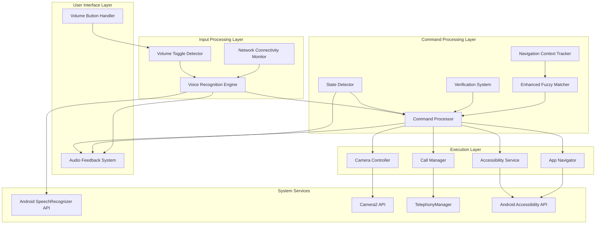

# Design Document: Voice Accessibility System Upgrade

## Overview

This design document specifies the architecture and implementation details for upgrading the voice-controlled accessibility application for blind users. The system builds upon the existing Android accessibility service architecture to add:

1. **Volume Button Toggle System**: Physical hardware button activation/deactivation mechanism
2. **Automatic Online/Offline Voice Recognition**: Seamless switching between cloud and on-device speech recognition
3. **Smart State Detection**: Context-aware verification system for sensitive operations
4. **Multi-Step Contextual Navigation**: Pronoun resolution and command chaining
5. **Enhanced App Integration**: Support for 20+ popular applications
6. **Camera Control with Verification**: Voice-controlled photography with safety checks
7. **Call Management with Verification**: In-call command processing with security
8. **Smart Fuzzy Matching Enhancements**: Improved command recognition accuracy
9. **Comprehensive Audio Feedback**: Text-to-speech announcements for all actions
10. **Battery Optimization**: Zero-power consumption in inactive state

The design maintains the existing Kotlin/Android architecture while adding new components that integrate seamlessly with the current `AutomationAccessibilityService`, `CommandProcessor`, and `SmartCommandMatcher` infrastructure.

## Architecture

### System Architecture Diagram



### Architecture Principles

1. **Layered Architecture**: Clear separation between input detection, command processing, and execution
2. **State Machine Design**: Explicit state management for listening modes and phone states
3. **Event-Driven**: Asynchronous event handling for hardware buttons, network changes, and system callbacks
4. **Zero-Battery Inactive Mode**: Complete shutdown of voice recognition when inactive
5. **Fail-Safe Verification**: Multi-layer security for sensitive operations
6. **Context Preservation**: Stateful navigation tracking across command sequences

### Component Interaction Flow

1. **Activation Flow**: Volume buttons → Toggle detector → Voice engine activation → Audio feedback
2. **Command Flow**: Voice input → Speech recognizer → Fuzzy matcher → State detector → Verification (if needed) → Command processor → Execution → Audio feedback
3. **State Change Flow**: System event → State detector → State update → Verification requirement update → Audio announcement
4. **Network Change Flow**: Network event → Network monitor → Voice engine mode switch → Audio announcement

## Components and Interfaces

### 1. Volume Toggle Detector

**Purpose**: Detect simultaneous volume button presses to toggle listening state

**Class**: `VolumeToggleDetector`

**Responsibilities**:
- Monitor volume button press events
- Detect simultaneous presses within 600ms window
- Trigger state transitions between ACTIVE and INACTIVE
- Prevent interference with normal volume control

**Interface**:
```kotlin
class VolumeToggleDetector(private val context: Context) {
    interface ToggleListener {
        fun onToggleDetected()
    }
    
    fun setListener(listener: ToggleListener)
    fun onVolumeKeyDown(keyCode: Int, event: KeyEvent): Boolean
    fun onVolumeKeyUp(keyCode: Int, event: KeyEvent): Boolean
    fun isToggleGesture(): Boolean
}
```

**State Machine**:
```
IDLE → VOLUME_DOWN_PRESSED → BOTH_PRESSED → TOGGLE_DETECTED → IDLE
IDLE → VOLUME_UP_PRESSED → BOTH_PRESSED → TOGGLE_DETECTED → IDLE
```

**Implementation Details**:
- Track timestamps of volume down and volume up key events
- If both keys pressed within 600ms window, trigger toggle
- Reset state after 1000ms timeout
- Use `KeyEvent.KEYCODE_VOLUME_DOWN` and `KeyEvent.KEYCODE_VOLUME_UP`
- Implement in `AutomationForegroundService` to work when screen is off


### 2. Voice Recognition Engine (Enhanced)

**Purpose**: Manage speech recognition with automatic online/offline switching

**Class**: `GoogleVoiceCommandManager` (existing, to be enhanced)

**Enhancements**:
- Add automatic mode detection and switching
- Add offline model availability checking
- Add mode change announcements
- Add network connectivity monitoring

**Interface**:
```kotlin
class GoogleVoiceCommandManager(private val context: Context) {
    enum class RecognitionMode {
        ONLINE,   // Cloud-based Google services
        OFFLINE   // On-device models
    }
    
    interface VoiceCommandListener {
        fun onCommandReceived(command: String): Boolean
        fun onListeningStarted()
        fun onListeningStopped()
        fun onError(errorMessage: String)
        fun onModeChanged(mode: RecognitionMode)
    }
    
    fun startListening()
    fun stopListening()
    fun pauseListening()
    fun resumeListening()
    fun getCurrentMode(): RecognitionMode
    fun isOfflineModeAvailable(): Boolean
}
```

**Mode Switching Logic**:
1. On startup: Check network connectivity
2. If network available: Use ONLINE mode
3. If network unavailable: Check for offline models
4. If offline models available: Use OFFLINE mode
5. If offline models not available: Announce error and provide guidance
6. On network change: Switch modes automatically within 2 seconds
7. Announce mode changes via audio feedback

**Offline Model Detection**:
- Use `SpeechRecognizer.createOnDeviceSpeechRecognizer()` (Android 12+)
- Check if recognizer creation succeeds
- If fails, check for error code 13 (service not available)
- Provide user guidance: "Download speech models from Google app settings"


### 3. State Detector

**Purpose**: Monitor phone state and determine verification requirements

**Class**: `PhoneStateDetector`

**Responsibilities**:
- Continuously monitor phone state
- Classify state as NORMAL, CONSUMING_CONTENT, IN_CALL, or CAMERA_ACTIVE
- Notify listeners of state changes
- Provide verification requirement information

**Interface**:
```kotlin
class PhoneStateDetector(private val context: Context) {
    enum class PhoneState {
        NORMAL,              // No special state
        CONSUMING_CONTENT,   // Video playing or photo viewing
        IN_CALL,            // Active phone call
        CAMERA_ACTIVE       // Camera app open
    }
    
    interface StateChangeListener {
        fun onStateChanged(oldState: PhoneState, newState: PhoneState)
    }
    
    fun getCurrentState(): PhoneState
    fun requiresVerification(): Boolean
    fun setListener(listener: StateChangeListener)
    fun startMonitoring()
    fun stopMonitoring()
}
```

**State Detection Methods**:

1. **CONSUMING_CONTENT Detection**:
   - Monitor `AudioManager.isMusicActive()`
   - Check for video player apps in foreground (YouTube, Netflix, etc.)
   - Check for photo viewer apps (Gallery, Photos, etc.)
   - Use accessibility service to detect media playback UI elements

2. **IN_CALL Detection**:
   - Register `PhoneStateListener` with `TelephonyManager`
   - Monitor `TelephonyManager.CALL_STATE_OFFHOOK` (call active)
   - Monitor `TelephonyManager.CALL_STATE_RINGING` (incoming call)
   - Transition to NORMAL when `CALL_STATE_IDLE`

3. **CAMERA_ACTIVE Detection**:
   - Monitor foreground app package name
   - Check for camera app packages (com.android.camera, etc.)
   - Use `CameraManager.registerAvailabilityCallback()` to detect camera usage

4. **NORMAL State**:
   - Default state when no other conditions met

**Verification Logic**:
- NORMAL: No verification required
- CONSUMING_CONTENT: Verification required for all commands
- IN_CALL: Verification required for all commands
- CAMERA_ACTIVE: Verification required for capture/record commands only


### 4. Verification System

**Purpose**: Manage verification code storage, validation, and enforcement

**Class**: `VerificationSystem`

**Responsibilities**:
- Store and retrieve user's verification code
- Validate verification codes against stored value
- Track verification attempts and lockout
- Provide verification requirement information based on state

**Interface**:
```kotlin
class VerificationSystem(private val context: Context) {
    fun setVerificationCode(code: String)
    fun getVerificationCode(): String
    fun validateCode(inputCode: String): Boolean
    fun requiresVerification(state: PhoneStateDetector.PhoneState, command: String): Boolean
    fun extractCodeFromCommand(command: String): Pair<String?, String>  // Returns (code, remainingCommand)
    fun resetAttempts()
    fun getRemainingAttempts(): Int
}
```

**Storage**:
- Use `SharedPreferences` with encryption
- Default code: "1234"
- Allow user to configure during setup

**Validation Logic**:
```kotlin
fun validateCode(inputCode: String): Boolean {
    val storedCode = getVerificationCode()
    val normalized = inputCode.replace(" ", "").trim()
    return normalized == storedCode
}
```

**Code Extraction**:
- Parse command for leading digits
- Support both "1234 end call" and "one two three four end call"
- Convert spoken numbers to digits
- Return extracted code and remaining command

**Verification Requirements**:
- NORMAL state: No verification
- CONSUMING_CONTENT state: All commands require verification
- IN_CALL state: All commands require verification (code as prefix)
- CAMERA_ACTIVE state: Only capture/record commands require verification


### 5. Navigation Context Tracker

**Purpose**: Track navigation context for pronoun resolution and command chaining

**Class**: `NavigationContextTracker`

**Responsibilities**:
- Track current app, screen, focused user, and UI element
- Resolve pronouns to concrete entities
- Maintain command history
- Clear context on app switches

**Interface**:
```kotlin
class NavigationContextTracker {
    data class NavigationContext(
        val currentApp: String? = null,
        val currentScreen: String? = null,
        val focusedUser: String? = null,
        val focusedElement: String? = null,
        val commandHistory: List<String> = emptyList()
    )
    
    fun updateApp(appName: String)
    fun updateScreen(screenName: String)
    fun setFocusedUser(userName: String)
    fun setFocusedElement(elementName: String)
    fun addCommandToHistory(command: String)
    fun resolvePronoun(pronoun: String): String?
    fun getContext(): NavigationContext
    fun clearUserContext()
    fun clearAll()
}
```

**Pronoun Resolution**:
```kotlin
fun resolvePronoun(pronoun: String): String? {
    return when (pronoun.lowercase()) {
        "his", "her", "their" -> focusedUser
        "that", "this", "it" -> focusedElement
        else -> null
    }
}
```

**Context Updates**:
- Update app when "open [app]" command executed
- Update focused user when "search [name]" command executed
- Update focused element when UI element is interacted with
- Clear focused user/element on app switch
- Maintain last 10 commands in history

**Command Chaining**:
- Parse multi-step commands separated by commas
- Execute each step sequentially
- Maintain context between steps
- Example: "Open Instagram, search John, open his profile, scroll photos"


### 6. Camera Controller

**Purpose**: Control camera operations with verification and audio feedback

**Class**: `CameraController`

**Responsibilities**:
- Open/close camera application
- Capture photos and videos
- Switch between front/back cameras
- Control flash and zoom
- Provide face detection feedback for selfies
- Provide countdown for captures

**Interface**:
```kotlin
class CameraController(private val context: Context) {
    interface CameraListener {
        fun onCameraOpened()
        fun onPhotoCaptured(uri: Uri)
        fun onVideoRecordingStarted()
        fun onVideoRecordingStopped(uri: Uri)
        fun onFaceDetected(count: Int)
        fun onFaceCentered()
        fun onError(message: String)
    }
    
    fun openCamera()
    fun closeCamera()
    fun capturePhoto()
    fun captureSelfie()
    fun switchCamera()
    fun startVideoRecording()
    fun stopVideoRecording()
    fun toggleFlash(enabled: Boolean)
    fun adjustZoom(direction: Int)  // +1 for zoom in, -1 for zoom out
    fun isCameraOpen(): Boolean
}
```

**Implementation Details**:

1. **Camera Opening**:
   - Use `Intent(MediaStore.ACTION_IMAGE_CAPTURE)` for simple capture
   - Or use Camera2 API for advanced control
   - Detect camera app in foreground via accessibility service

2. **Photo Capture**:
   - Use accessibility service to click capture button
   - Or use Camera2 API `CaptureRequest`
   - Provide audio feedback "Photo captured"

3. **Selfie Mode**:
   - Switch to front camera first
   - Enable face detection using Camera2 API
   - Announce "Face detected" when face found
   - Announce "Face centered" when face is centered
   - Provide countdown "3, 2, 1" before capture
   - Capture photo automatically

4. **Face Detection**:
   - Use `CameraCharacteristics.STATISTICS_INFO_AVAILABLE_FACE_DETECT_MODES`
   - Register `CaptureCallback` to receive face detection results
   - Calculate face position relative to frame center
   - Announce when face is centered (within 20% of center)

5. **Video Recording**:
   - Use accessibility service to click record button
   - Track recording state
   - Provide audio feedback for start/stop


### 7. Call Manager

**Purpose**: Manage phone call operations with verification during active calls

**Class**: `CallManager`

**Responsibilities**:
- Answer/reject/end calls
- Mute/unmute microphone
- Toggle speakerphone
- Manage conference calls
- Start/stop call recording
- Track call state

**Interface**:
```kotlin
class CallManager(private val context: Context) {
    interface CallListener {
        fun onCallStateChanged(state: CallState)
        fun onCallAnswered()
        fun onCallEnded()
        fun onMuteChanged(isMuted: Boolean)
        fun onSpeakerChanged(isSpeakerOn: Boolean)
        fun onRecordingStarted()
        fun onRecordingStopped()
    }
    
    enum class CallState {
        IDLE, RINGING, ACTIVE, ON_HOLD
    }
    
    fun answerCall()
    fun rejectCall()
    fun endCall()
    fun muteCall()
    fun unmuteCall()
    fun toggleSpeaker()
    fun addCall()
    fun mergeCalls()
    fun switchCall()
    fun startRecording()
    fun stopRecording()
    fun getCallState(): CallState
}
```

**Implementation Details**:

1. **Call State Monitoring**:
   - Register `PhoneStateListener` with `TelephonyManager`
   - Track state transitions: IDLE → RINGING → ACTIVE → IDLE
   - Notify `PhoneStateDetector` of state changes

2. **Answer/Reject Call**:
   - Use `TelecomManager.acceptRingingCall()` (Android 8+)
   - Use `TelecomManager.endCall()` for reject
   - Provide audio feedback

3. **Mute/Unmute**:
   - Use `AudioManager.setMicrophoneMute()`
   - Track mute state
   - Provide audio feedback

4. **Speaker Toggle**:
   - Use `AudioManager.setSpeakerphoneOn()`
   - Track speaker state
   - Provide audio feedback

5. **Conference Calls**:
   - Use `TelecomManager` API for conference management
   - Add call: Initiate new call while existing call on hold
   - Merge calls: Combine multiple calls into conference

6. **Call Recording**:
   - Use `MediaRecorder` with audio source `MediaRecorder.AudioSource.VOICE_CALL`
   - Requires `RECORD_AUDIO` permission
   - Store recordings in app-specific directory
   - Provide audio feedback for start/stop


### 8. App Navigator

**Purpose**: Navigate and control specific applications

**Class**: `AppNavigator`

**Responsibilities**:
- Open applications
- Navigate within apps using accessibility service
- Execute app-specific actions
- Search for users/content
- Scroll through feeds/photos/videos

**Interface**:
```kotlin
class AppNavigator(
    private val context: Context,
    private val accessibilityService: AutomationAccessibilityService
) {
    fun openApp(appName: String): Boolean
    fun searchUser(appName: String, userName: String): Boolean
    fun openProfile(appName: String, userName: String): Boolean
    fun scrollFeed(appName: String, direction: String): Boolean
    fun scrollPhotos(appName: String): Boolean
    fun scrollReels(appName: String): Boolean
    fun scrollStories(appName: String): Boolean
    fun openDirectMessages(appName: String): Boolean
    fun sendMessage(appName: String, contact: String, message: String): Boolean
    fun makeCall(appName: String, contact: String, isVideo: Boolean): Boolean
}
```

**Supported Apps**:

1. **Instagram**:
   - Actions: open app, search users, view profiles, scroll reels, scroll photos, scroll stories, open DMs
   - UI elements: Search button (resource-id: search_tab), Profile button, Reels tab, Stories bar

2. **WhatsApp**:
   - Actions: open chats, search contacts, send messages, view status, make voice/video calls
   - UI elements: Chats tab, Search button, Call button, Video call button

3. **Phone**:
   - Actions: make calls, answer calls, reject calls, end calls, mute/unmute
   - UI elements: Dialpad, Call button, End call button, Mute button

4. **Facebook**:
   - Actions: navigate feed, open groups, browse marketplace, watch videos, view profiles
   - UI elements: News Feed, Groups tab, Marketplace tab, Watch tab

5. **YouTube**:
   - Actions: search videos, play/pause, navigate channels, browse playlists, adjust speed
   - UI elements: Search button, Play/Pause button, Channel tab, Playlists

6. **Twitter/X**:
   - Actions: view timeline, read tweets, view profiles, join spaces
   - UI elements: Home timeline, Profile button, Spaces tab

**Implementation Strategy**:
- Use accessibility service to find UI elements by resource-id, text, or content description
- Maintain app-specific UI element mappings
- Use `AccessibilityNodeInfo.findAccessibilityNodeInfosByText()` for text-based search
- Use `AccessibilityNodeInfo.findAccessibilityNodeInfosByViewId()` for resource-id search
- Perform actions using `AccessibilityNodeInfo.performAction()`


### 9. Enhanced Fuzzy Matcher

**Purpose**: Improve command matching with context awareness and learning

**Class**: `SmartCommandMatcher` (existing, to be enhanced)

**Enhancements**:
- Add context-aware disambiguation
- Add pronunciation variation support
- Add multi-language support (English, Hindi, Hinglish)
- Add learning from corrections

**New Methods**:
```kotlin
object SmartCommandMatcher {
    fun matchWithContext(
        command: String,
        context: NavigationContextTracker.NavigationContext
    ): MatchResult?
    
    fun addSynonym(canonical: String, variation: String)
    fun learnFromCorrection(input: String, correctIntent: CommandIntent)
    fun getConfidenceScore(input: String, intent: CommandIntent): Float
}
```

**Context-Aware Matching**:
- Use navigation context to disambiguate commands
- Example: "open" in Instagram profile screen → "open profile" not "open app"
- Example: "scroll" in Instagram → "scroll feed" vs "scroll photos" based on current screen

**Pronunciation Variations**:
- Maintain synonym database for each command
- Example: "Instagram" → ["insta", "instagram", "insta gram", "instagram app"]
- Example: "WhatsApp" → ["whatsapp", "whats app", "watsapp", "what's app"]

**Edit Distance Matching**:
- Use Levenshtein distance for fuzzy matching
- Allow 1-2 character differences for words 4+ characters
- Example: "instgram" → "instagram" (distance = 1)

**Learning System**:
- Track successful command mappings
- Store in `CommandMemory` for faster future recall
- Learn from user corrections when disambiguation fails


### 10. Audio Feedback System

**Purpose**: Provide comprehensive text-to-speech announcements for all actions

**Class**: `AudioFeedbackManager`

**Responsibilities**:
- Announce state transitions
- Announce command execution results
- Announce errors and guidance
- Pause voice recognition during announcements
- Manage TTS queue

**Interface**:
```kotlin
class AudioFeedbackManager(private val context: Context) {
    interface FeedbackListener {
        fun onSpeechStarted()
        fun onSpeechCompleted()
    }
    
    fun announce(message: String, priority: Priority = Priority.NORMAL)
    fun announceWithCallback(message: String, callback: () -> Unit)
    fun stopSpeaking()
    fun isSpeaking(): Boolean
    fun setListener(listener: FeedbackListener)
    
    enum class Priority {
        HIGH,    // Interrupt current speech
        NORMAL,  // Queue after current speech
        LOW      // Queue at end
    }
}
```

**Announcement Categories**:

1. **State Transitions**:
   - "Listening" (INACTIVE → ACTIVE)
   - Haptic feedback only (ACTIVE → INACTIVE)
   - "Online mode" / "Offline mode" (mode changes)
   - "Call active, verification required" (state changes)

2. **Command Execution**:
   - "Opening [app name]"
   - "Calling [contact name]"
   - "Photo captured"
   - "Recording started"
   - "Call muted"

3. **Verification**:
   - "Incorrect code"
   - "Verified"

4. **Errors**:
   - "Command not recognized"
   - "Permission required"
   - "Offline voice recognition requires downloading speech models"

5. **Camera Feedback**:
   - "Face detected"
   - "Face centered"
   - "3, 2, 1" (countdown)

**TTS Integration**:
- Use Android `TextToSpeech` API
- Configure language: English (India) for best Hindi/Hinglish support
- Set speech rate: 1.0 (normal)
- Pause voice recognition while speaking to prevent echo
- Resume voice recognition after speech completes


### 11. Battery Optimization Manager

**Purpose**: Minimize battery consumption in inactive state

**Class**: `BatteryOptimizationManager`

**Responsibilities**:
- Manage listening state transitions
- Shutdown voice recognition in inactive state
- Implement low-power listening mode
- Monitor CPU usage

**Interface**:
```kotlin
class BatteryOptimizationManager(private val context: Context) {
    enum class ListeningState {
        INACTIVE,      // Zero battery consumption
        ACTIVE,        // Full listening mode
        LOW_POWER      // Reduced power listening
    }
    
    fun transitionToInactive()
    fun transitionToActive()
    fun transitionToLowPower()
    fun getCurrentState(): ListeningState
    fun getEstimatedBatteryUsage(): Float  // Percentage per hour
}
```

**Power States**:

1. **INACTIVE State**:
   - Voice recognition completely stopped
   - Only volume button monitoring active
   - Zero CPU usage for voice processing
   - No network connections
   - No background processing

2. **ACTIVE State**:
   - Full voice recognition running
   - Continuous listening for commands
   - Maximum 5% CPU usage
   - Network connection for online mode

3. **LOW_POWER State**:
   - Reduced sensitivity listening
   - Triggered after 30 seconds of no speech
   - Wake up within 200ms when speech detected
   - Reduced CPU usage (2-3%)

**Implementation**:
- Use `PowerManager.WakeLock` only when in ACTIVE state
- Release wake lock in INACTIVE state
- Use `JobScheduler` for background tasks instead of continuous services
- Monitor battery level and adjust behavior


## Data Models

### 1. System State Model

```kotlin
data class SystemState(
    val listeningState: ListeningState,
    val phoneState: PhoneStateDetector.PhoneState,
    val recognitionMode: RecognitionMode,
    val verificationRequired: Boolean,
    val lastCommand: String?,
    val lastCommandTime: Long
)

enum class ListeningState {
    INACTIVE,
    ACTIVE,
    LOW_POWER
}

enum class RecognitionMode {
    ONLINE,
    OFFLINE
}
```

### 2. Navigation Context Model

```kotlin
data class NavigationContext(
    val currentApp: String? = null,
    val currentScreen: String? = null,
    val focusedUser: String? = null,
    val focusedElement: String? = null,
    val commandHistory: List<CommandHistoryEntry> = emptyList()
)

data class CommandHistoryEntry(
    val command: String,
    val timestamp: Long,
    val intent: SmartCommandMatcher.CommandIntent,
    val success: Boolean
)
```

### 3. Verification Model

```kotlin
data class VerificationConfig(
    val code: String,
    val requiresVerificationInCall: Boolean = true,
    val requiresVerificationForContent: Boolean = true,
    val requiresVerificationForCamera: Boolean = true,
    val maxAttempts: Int = 3
)

data class VerificationAttempt(
    val inputCode: String,
    val timestamp: Long,
    val success: Boolean
)
```

### 4. Camera State Model

```kotlin
data class CameraState(
    val isOpen: Boolean = false,
    val currentCamera: CameraFacing = CameraFacing.BACK,
    val isRecording: Boolean = false,
    val flashEnabled: Boolean = false,
    val zoomLevel: Float = 1.0f,
    val faceDetectionEnabled: Boolean = false,
    val facesDetected: Int = 0,
    val isFaceCentered: Boolean = false
)

enum class CameraFacing {
    FRONT,
    BACK
}
```

### 5. Call State Model

```kotlin
data class CallState(
    val state: CallPhase,
    val isMuted: Boolean = false,
    val isSpeakerOn: Boolean = false,
    val isRecording: Boolean = false,
    val callStartTime: Long? = null,
    val callDuration: Long = 0
)

enum class CallPhase {
    IDLE,
    RINGING,
    ACTIVE,
    ON_HOLD
}
```

### 6. App Navigation Model

```kotlin
data class AppNavigationState(
    val appPackage: String,
    val appName: String,
    val currentScreen: String?,
    val availableActions: List<AppAction>
)

data class AppAction(
    val name: String,
    val command: String,
    val requiresParameter: Boolean,
    val uiElementId: String?
)
```

### 7. Voice Recognition Model

```kotlin
data class VoiceRecognitionResult(
    val text: String,
    val confidence: Float,
    val mode: RecognitionMode,
    val timestamp: Long,
    val alternatives: List<String> = emptyList()
)

data class RecognitionConfig(
    val language: String = "en-IN",
    val preferOffline: Boolean = false,
    val maxResults: Int = 5,
    val partialResults: Boolean = true
)
```


## Correctness Properties

*A property is a characteristic or behavior that should hold true across all valid executions of a system—essentially, a formal statement about what the system should do. Properties serve as the bridge between human-readable specifications and machine-verifiable correctness guarantees.*

### Property Reflection

After analyzing all acceptance criteria, I identified the following redundancies and consolidations:

**Redundant Properties Eliminated**:
1. Requirements 3.7 and 3.8 (verification in CONSUMING_CONTENT and IN_CALL) can be combined into a single property about verification in non-NORMAL states
2. Requirements 1.2 and 1.3 (state transitions on toggle) can be combined into a single toggle property
3. Requirements 2.2 and 2.3 (mode selection based on network) can be combined into a single mode selection property
4. Requirements 2.4 and 2.5 (mode switching timing) can be combined into a single mode switching property
5. Requirements 3.3, 3.4, 3.5 (state classification) can be combined into a single state classification property
6. Requirements 6.12 and 7.14 (audio feedback for actions) can be combined into a universal audio feedback property
7. Requirements 1.6 and 10.1 (zero battery in inactive) are identical - keep one
8. Requirements 3.15 and 7.12 (call end state transition) are identical - keep one
9. Requirements 3.9 and 6.2 (camera verification) are identical - keep one

**Properties Combined for Comprehensiveness**:
1. All verification requirements (3.6, 3.7, 3.8, 3.9, 3.10) combined into comprehensive verification property
2. All state detection requirements (3.3, 3.4, 3.5) combined into state classification property
3. All mode switching requirements (2.2, 2.3, 2.4, 2.5) combined into mode management property

This reduces the property count from 60+ individual criteria to approximately 25 unique, non-redundant properties.

### Core System Properties

**Property 1: Volume Toggle State Transition**
*For any* system state (ACTIVE or INACTIVE), when both volume buttons are pressed simultaneously within 600ms, the system should transition to the opposite state (ACTIVE ↔ INACTIVE)
**Validates: Requirements 1.1, 1.2, 1.3**

**Property 2: State Transition Audio Feedback**
*For any* transition to ACTIVE state, the system should provide audio feedback announcing "Listening"; for any transition to INACTIVE state, the system should provide haptic feedback without audio
**Validates: Requirements 1.4, 1.5**

**Property 3: Zero Battery Consumption in Inactive State**
*For any* system in INACTIVE state, the voice recognition engine should not be running and should consume zero CPU cycles
**Validates: Requirements 1.6, 10.1**

**Property 4: Active Listening in Active State**
*For any* system in ACTIVE state, the voice recognition engine should be continuously listening for voice commands
**Validates: Requirements 1.7**


### Voice Recognition Properties

**Property 5: Recognition Mode Selection**
*For any* system state, when internet connectivity is available, the voice recognition engine should operate in ONLINE mode; when internet connectivity is unavailable, the engine should operate in OFFLINE mode
**Validates: Requirements 2.2, 2.3**

**Property 6: Automatic Mode Switching**
*For any* network connectivity change (available ↔ unavailable), the voice recognition engine should automatically switch modes within 2 seconds
**Validates: Requirements 2.4, 2.5**

**Property 7: Command Consistency Across Modes**
*For any* voice command, the command processor should produce identical results in both ONLINE mode and OFFLINE mode
**Validates: Requirements 2.10**

**Property 8: Mode Change Announcements**
*For any* mode switch (ONLINE ↔ OFFLINE), the system should provide audio feedback announcing the current mode
**Validates: Requirements 2.11**

### State Detection Properties

**Property 9: State Classification**
*For any* phone state, the state detector should classify it as exactly one of: NORMAL, CONSUMING_CONTENT, IN_CALL, or CAMERA_ACTIVE based on current conditions (video/photo viewing, call status, camera status)
**Validates: Requirements 3.1, 3.3, 3.4, 3.5**

**Property 10: Verification Requirements by State**
*For any* command in NORMAL state, no verification should be required; for any command in CONSUMING_CONTENT or IN_CALL state, verification should be required; for any capture/record command in CAMERA_ACTIVE state, verification should be required; for any non-capture command in CAMERA_ACTIVE state, no verification should be required
**Validates: Requirements 3.6, 3.7, 3.8, 3.9, 3.10**

**Property 11: Verification Code Validation**
*For any* verification attempt, if the provided code matches the stored verification code, the command should execute; if the code does not match, the system should reject the command and announce "Incorrect code"
**Validates: Requirements 3.13, 3.14**

**Property 12: Call End State Transition**
*For any* state transition from IN_CALL to NORMAL (when call ends), the state detector should update the state within 1 second
**Validates: Requirements 3.15, 7.12**

### Navigation Context Properties

**Property 13: Context Field Tracking**
*For any* navigation context, it should track current app name, screen name, focused user, and focused UI element
**Validates: Requirements 4.1**

**Property 14: Context Updates on Commands**
*For any* app open command, the navigation context should update the current app name; for any user search command, the context should store the user as focused user
**Validates: Requirements 4.2, 4.3**

**Property 15: Pronoun Resolution**
*For any* command containing a pronoun ("his", "her", "their", "that", "this", "it") and a non-empty navigation context, the command processor should resolve the pronoun to the corresponding entity from the context (focused user or focused element)
**Validates: Requirements 4.4**

**Property 16: Command History Size Limit**
*For any* sequence of executed commands, the command memory should maintain at most the last 10 commands in history
**Validates: Requirements 4.7**

**Property 17: Missing Context Error Handling**
*For any* pronoun command when navigation context is empty, the system should provide audio feedback "Please specify who or what you're referring to" and not execute the command
**Validates: Requirements 4.8**

**Property 18: Command Chaining Execution**
*For any* chained command sequence (multiple commands separated by commas), the system should execute each step sequentially and maintain context between steps
**Validates: Requirements 4.9**

**Property 19: Context Clearing on App Switch**
*For any* app switch command, the navigation context should clear the focused user and UI element while retaining command history
**Validates: Requirements 4.10**


### Camera Control Properties

**Property 20: Selfie Face Detection Feedback**
*For any* selfie capture with face detection enabled, when a face is detected, the system should announce "Face detected"; when the face is centered, the system should announce "Face centered"
**Validates: Requirements 6.10**

**Property 21: Selfie Countdown**
*For any* selfie capture, the system should provide a countdown "3, 2, 1" before capturing the photo
**Validates: Requirements 6.11**

**Property 22: Universal Camera Action Feedback**
*For any* camera action (capture, record, flash, zoom), the system should provide audio feedback confirming the action or describing any error
**Validates: Requirements 6.12, 6.13**

### Call Management Properties

**Property 23: Universal Call Action Feedback**
*For any* call management action (answer, end, mute, unmute, speaker toggle, recording), the system should provide audio feedback confirming the action
**Validates: Requirements 7.14**

### Fuzzy Matching Properties

**Property 24: Pronunciation Variation Matching**
*For any* command with pronunciation variations (e.g., "Instagram", "Insta", "insta gram"), the fuzzy matcher should map all variations to the same canonical command intent
**Validates: Requirements 8.1, 8.2**

**Property 25: Context-Aware Disambiguation**
*For any* ambiguous command with navigation context available, the fuzzy matcher should use the context to disambiguate and select the correct intent
**Validates: Requirements 8.3, 8.4**

**Property 26: Multi-Language Support**
*For any* command in English, Hindi, or Hinglish, the fuzzy matcher should correctly match the command to its intent
**Validates: Requirements 8.5**

**Property 27: Edit Distance Fuzzy Matching**
*For any* command with minor speech recognition errors (1-2 character differences), the fuzzy matcher should use edit distance to find the closest matching command
**Validates: Requirements 8.6**

**Property 28: Ambiguity Clarification**
*For any* command that matches multiple intents with similar confidence scores, the system should ask for clarification with audio feedback listing the options
**Validates: Requirements 8.8**

**Property 29: Learning from Corrections**
*For any* user correction of a mismatched command, the fuzzy matcher should learn the mapping and improve future matching accuracy for similar inputs
**Validates: Requirements 8.9**

### Battery Optimization Properties

**Property 30: Inactive State Resource Cleanup**
*For any* system in INACTIVE state, there should be no persistent network connections and no background processing tasks running
**Validates: Requirements 10.5, 10.6**

**Property 31: Low-Power Mode Transition**
*For any* system in ACTIVE state with no speech detected for 30 seconds, the system should automatically transition to low-power listening mode
**Validates: Requirements 10.7**

**Property 32: Low-Power Mode Wake-Up**
*For any* system in low-power listening mode, when speech is detected, the system should resume full listening mode within 200ms
**Validates: Requirements 10.8**

**Property 33: On-Demand UI Queries**
*For any* accessibility service operation, UI element queries should only occur when executing commands, not continuously
**Validates: Requirements 10.9**


## Error Handling

### Error Categories

1. **Voice Recognition Errors**
   - Network timeout during online mode
   - Offline models not installed
   - Speech recognition service unavailable
   - No speech detected
   - Audio recording permission denied

2. **State Detection Errors**
   - Unable to determine phone state
   - Camera availability callback failure
   - Telephony manager access denied
   - Media playback state unknown

3. **Verification Errors**
   - Incorrect verification code
   - Maximum attempts exceeded
   - Verification code not configured

4. **Command Execution Errors**
   - Permission denied (camera, phone, accessibility)
   - Target app not installed
   - UI element not found
   - Action not supported in current state

5. **Hardware Errors**
   - Volume button detection failure
   - Camera hardware unavailable
   - Microphone unavailable
   - Speaker/audio output failure

### Error Handling Strategies

**1. Voice Recognition Error Handling**

```kotlin
when (error) {
    ERROR_NETWORK -> {
        // Switch to offline mode
        switchToOfflineMode()
        announce("Switching to offline mode")
    }
    ERROR_SERVICE_NOT_AVAILABLE -> {
        if (isOfflineMode && !offlineModelsInstalled) {
            announce("Offline voice recognition requires downloading speech models from Google app settings")
            // Provide guidance to user
        } else {
            // Retry with exponential backoff
            retryWithBackoff()
        }
    }
    ERROR_NO_MATCH, ERROR_SPEECH_TIMEOUT -> {
        // Normal - just restart listening
        restartListening()
    }
    ERROR_INSUFFICIENT_PERMISSIONS -> {
        announce("Microphone permission required")
        // Request permission
    }
}
```

**2. State Detection Error Handling**

```kotlin
try {
    val state = detectCurrentState()
} catch (e: SecurityException) {
    // Permission denied - use fallback detection
    state = PhoneState.NORMAL
    Log.w(TAG, "State detection permission denied, using NORMAL state")
} catch (e: Exception) {
    // Unknown error - use safe default
    state = PhoneState.NORMAL
    Log.e(TAG, "State detection failed: ${e.message}")
}
```

**3. Verification Error Handling**

```kotlin
fun validateCode(inputCode: String): Boolean {
    if (inputCode.isBlank()) {
        announce("Verification code required")
        return false
    }
    
    val isValid = inputCode == storedCode
    if (!isValid) {
        attemptsRemaining--
        announce("Incorrect code. $attemptsRemaining attempts remaining")
        
        if (attemptsRemaining <= 0) {
            // Lockout for 30 seconds
            lockoutUntil = System.currentTimeMillis() + 30000
            announce("Too many incorrect attempts. Please wait 30 seconds")
        }
    }
    return isValid
}
```

**4. Command Execution Error Handling**

```kotlin
try {
    executeCommand(command)
} catch (e: SecurityException) {
    announce("Permission required for this action")
    // Request permission if possible
} catch (e: ActivityNotFoundException) {
    announce("App not installed")
} catch (e: IllegalStateException) {
    announce("Action not available in current state")
} catch (e: Exception) {
    announce("Command failed: ${e.message}")
    Log.e(TAG, "Command execution error", e)
}
```

**5. Graceful Degradation**

- If online mode fails, automatically switch to offline mode
- If offline mode unavailable, provide clear guidance to user
- If camera face detection fails, continue with capture without face feedback
- If state detection fails, default to NORMAL state (safest)
- If verification system fails, require verification for all commands (safest)

**6. User Feedback for All Errors**

- Every error must provide audio feedback explaining what went wrong
- Provide actionable guidance when possible (e.g., "Download speech models")
- Use clear, non-technical language for blind users
- Announce error severity (warning vs critical)


## Testing Strategy

### Dual Testing Approach

This feature requires both unit tests and property-based tests for comprehensive coverage:

- **Unit tests**: Verify specific examples, edge cases, and integration points
- **Property tests**: Verify universal properties across all inputs through randomization

### Property-Based Testing

**Testing Library**: Use **Kotest Property Testing** for Kotlin
- Mature property-based testing library for JVM/Android
- Supports generators for custom data types
- Integrates with JUnit and Android testing frameworks
- Minimum 100 iterations per property test

**Property Test Configuration**:
```kotlin
class VoiceAccessibilityPropertyTests : StringSpec({
    "Property 1: Volume Toggle State Transition" {
        checkAll(100, Arb.enum<ListeningState>()) { initialState ->
            val system = createSystem(initialState)
            system.handleVolumeToggle()
            val finalState = system.getState()
            
            finalState shouldBe initialState.opposite()
        }
    }
})
```

**Test Tags**: Each property test must reference its design document property
```kotlin
// Feature: voice-accessibility-system-upgrade, Property 1: Volume Toggle State Transition
```

### Unit Testing

**Focus Areas for Unit Tests**:

1. **Specific Examples**:
   - Volume button press timing edge cases (599ms, 600ms, 601ms)
   - Specific app navigation flows (Instagram search → profile → photos)
   - Specific verification codes ("1234", "0000", "9999")
   - Specific camera commands ("take photo", "take selfie", "switch camera")

2. **Integration Points**:
   - Voice recognition engine initialization
   - State detector callback registration
   - Camera2 API integration
   - TelephonyManager integration
   - Accessibility service integration

3. **Edge Cases**:
   - Empty verification code
   - Network connectivity during mode switch
   - Call ending during command execution
   - App not installed
   - Permission denied scenarios

4. **Error Conditions**:
   - Offline models not installed
   - Camera hardware unavailable
   - Microphone permission denied
   - Invalid command format

**Unit Test Examples**:
```kotlin
@Test
fun `volume buttons pressed 599ms apart should not trigger toggle`() {
    val detector = VolumeToggleDetector(context)
    detector.onVolumeKeyDown(KEYCODE_VOLUME_DOWN, event1)
    Thread.sleep(599)
    detector.onVolumeKeyDown(KEYCODE_VOLUME_UP, event2)
    
    assertFalse(detector.isToggleGesture())
}

@Test
fun `open camera command should not require verification`() {
    val system = createSystem(PhoneState.NORMAL)
    val result = system.processCommand("open camera")
    
    assertTrue(result.executed)
    assertFalse(result.verificationRequired)
}
```

### Test Coverage Goals

- **Property Tests**: Cover all 33 correctness properties
- **Unit Tests**: Cover all specific examples and edge cases
- **Integration Tests**: Cover end-to-end flows for each major feature
- **Code Coverage**: Minimum 80% line coverage, 90% branch coverage

### Testing Challenges and Solutions

**Challenge 1: Testing Hardware Interactions**
- Solution: Use Android instrumentation tests with UIAutomator
- Mock volume button events using KeyEvent injection
- Test on physical devices for hardware-specific behavior

**Challenge 2: Testing Voice Recognition**
- Solution: Mock SpeechRecognizer with predefined results
- Test mode switching logic independently
- Use recorded audio samples for integration tests

**Challenge 3: Testing State Detection**
- Solution: Mock system services (TelephonyManager, AudioManager, CameraManager)
- Inject test callbacks for state changes
- Test state transitions independently

**Challenge 4: Testing Accessibility Service**
- Solution: Use AccessibilityNodeInfo mocks for unit tests
- Use real accessibility service for integration tests
- Test on multiple Android versions (API 26-34)

**Challenge 5: Testing Battery Optimization**
- Solution: Monitor CPU usage using Android Profiler
- Verify wake locks are released in inactive state
- Test power consumption using Battery Historian

### Continuous Integration

- Run all unit tests on every commit
- Run property tests (100 iterations) on every pull request
- Run integration tests on nightly builds
- Run performance tests weekly
- Test on multiple devices (different manufacturers, Android versions)

### Test Data Generators

**For Property-Based Tests**:
```kotlin
// Generate random system states
val stateGen = Arb.enum<ListeningState>()

// Generate random commands
val commandGen = Arb.choice(
    Arb.string(1..50),
    Arb.element(knownCommands)
)

// Generate random verification codes
val codeGen = Arb.string(4..4, Codepoint.digit())

// Generate random navigation contexts
val contextGen = Arb.bind(
    Arb.string(1..20),  // app name
    Arb.string(1..20),  // user name
    Arb.list(Arb.string(1..50), 0..10)  // command history
) { app, user, history ->
    NavigationContext(app, null, user, null, history)
}
```

### Manual Testing Checklist

Due to the accessibility nature of this app, manual testing by blind users is critical:

1. **Volume Toggle Testing**:
   - Test with screen on/off
   - Test with different volume levels
   - Test rapid toggle sequences

2. **Voice Recognition Testing**:
   - Test in quiet environment
   - Test in noisy environment
   - Test with different accents
   - Test in Hindi, English, and Hinglish

3. **State Detection Testing**:
   - Test during video playback
   - Test during phone calls
   - Test with camera open
   - Test state transitions

4. **App Navigation Testing**:
   - Test each supported app
   - Test multi-step navigation
   - Test pronoun resolution

5. **Verification Testing**:
   - Test correct code entry
   - Test incorrect code entry
   - Test during calls and content consumption

6. **Battery Testing**:
   - Monitor battery drain over 24 hours
   - Test inactive state power consumption
   - Test active state power consumption

